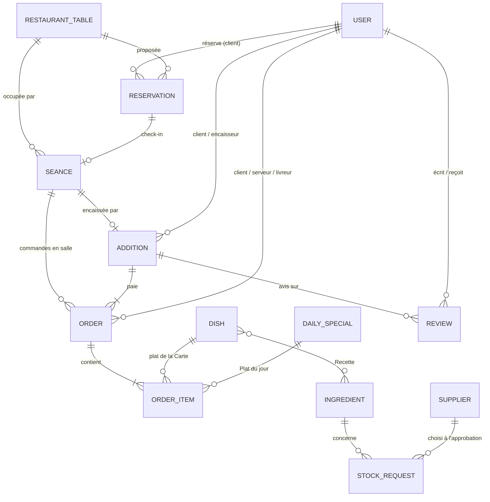

# Schéma de base de données (PostgreSQL)

La source de vérité est l'ensemble des modèles Django (`server/*/models.py`) et de leurs migrations. Pour obtenir le SQL exact : `python manage.py sqlmigrate <app> 0001`. Le vocabulaire est défini dans [`CONTEXT.md`](../CONTEXT.md).

Conventions : clé primaire `id` en `bigint` auto-incrémenté ; les choix (énumérations) sont stockés en `varchar` ; les dates sont `timestamptz` (UTC).

## 1. Modèle entité-association

`JOB_APPLICATION` est autonome : une Candidature acceptée crée un `USER`.

---

## 2. Tables

### `accounts_user` — personnel et clients
Hérite de l'utilisateur Django (`username` unique, `password` haché, `email`, `first_name`, `last_name`, `is_active`, …).

| Colonne | Type | Contraintes / valeurs |
| :--- | :--- | :--- |
| `role` | varchar(20) | `ADMIN_MANAGER`, `RESERVATION_MANAGER`, `CHEF`, `SERVER`, `CASHIER`, `DELIVERER`, `PARKING_ATTENDANT`, `STOCK_MANAGER`, `CLIENT` (défaut) |
| `phone` | varchar(20) | |
| `availability` | varchar(10) | `AVAILABLE` (défaut), `BUSY`, `OFFLINE`. Concerne les livreurs |

### `accounts_jobapplication` — Candidatures
| Colonne | Type | Contraintes / valeurs |
| :--- | :--- | :--- |
| `full_name`, `phone` | varchar | |
| `requested_role` | varchar(20) | `DELIVERER` ou `PARKING_ATTENDANT` |
| `username` | varchar(150) | **non unique** : on vérifie seulement qu'aucun compte ne le porte (une personne refusée peut recandidater) |
| `password` | varchar(128) | déjà haché |
| `status` | varchar(10) | `PENDING`, `ACCEPTED`, `REJECTED` |
| `created_at` | timestamptz | |

### `catalog_supplier` — Fournisseurs
| Colonne | Type | Contraintes / valeurs |
| :--- | :--- | :--- |
| `name` | varchar(100) | |
| `category` | varchar(20) | `EQUIPMENT`, `INGREDIENTS` |
| `contact_phone`, `email`, `address` | | optionnels |

### `catalog_restauranttable` — tables
| Colonne | Type | Contraintes / valeurs |
| :--- | :--- | :--- |
| `number` | integer | **unique** |
| `capacity` | smallint | **> 0** |
| `zone` | varchar(10) | `STANDARD` (défaut), `VIP` |

L'occupation n'est pas stockée : une table est occupée si elle a une Séance `OPEN`.

### `catalog_dish` — plats de la Carte
| Colonne | Type | Contraintes / valeurs |
| :--- | :--- | :--- |
| `name`, `description` | | |
| `photo` | varchar | `media/dishes/` |
| `price` | numeric(10,2) | **≥ 0** |
| `is_available` | boolean | choix du gérant |

`catalog_dish_ingredients` (M2M `dish_id`, `ingredient_id`) : la **Recette**, sans quantités. Un plat est disponible si `is_available` est vrai et qu'aucun ingrédient lié n'est en Rupture.

### `catalog_dailyspecial` — Plats du jour
| Colonne | Type | Contraintes / valeurs |
| :--- | :--- | :--- |
| `date` | date | **unique** (au plus un Plat du jour par date) |
| `name`, `description` | | |
| `photo` | varchar | `media/daily_specials/` |
| `price` | numeric(10,2) | **≥ 0** |
| `is_available` | boolean | passe à faux quand le Chef le retire |

### `catalog_ingredient` — ingrédients
| Colonne | Type | Contraintes / valeurs |
| :--- | :--- | :--- |
| `name` | varchar(100) | unique |
| `quantity_in_stock` | numeric(10,2) | |
| `unit` | varchar(20) | |
| `is_out_of_stock` | boolean | **Rupture** (seul le gestionnaire de stock la déclare ou la lève) |

### `catalog_stockrequest` — Demandes de réapprovisionnement
| Colonne | Type | Contraintes / valeurs |
| :--- | :--- | :--- |
| `ingredient_id` | FK → ingredient | `CASCADE` |
| `requested_by_id` | FK → user | `SET NULL` |
| `quantity_requested` | numeric(10,2) | **> 0** |
| `supplier_id` | FK → supplier | `PROTECT`, renseigné à l'approbation (fournisseur d'ingrédients) |
| `status` | varchar(10) | `PENDING` → `APPROVED` → `FULFILLED` |
| `created_at` | timestamptz | |

### `service_reservation` — réservations
| Colonne | Type | Contraintes / valeurs |
| :--- | :--- | :--- |
| `client_id` | FK → user | `CASCADE` |
| `table_id` | FK → restauranttable | `SET NULL` (table proposée, remplaçable dans la même Zone) |
| `guest_count` | smallint | **> 0**, corrigeable au check-in |
| `zone` | varchar(10) | `STANDARD`, `VIP` |
| `reservation_time` | timestamptz | début du créneau de 2 h |
| `has_vehicle` | boolean | |
| `parking_status` | varchar(10) | vide (sans véhicule), `REQUESTED`, `SECURED`, `REFUSED` |
| `parking_spot` | varchar(20) | renseigné si `SECURED` |
| `status` | varchar(12) | `PENDING`, `CONFIRMED`, `CHECKED_IN`, `DONE`, `CANCELLED`, `NO_SHOW` |
| `created_at` | timestamptz | |

### `service_seance` — Séances
| Colonne | Type | Contraintes / valeurs |
| :--- | :--- | :--- |
| `table_id` | FK → restauranttable | `PROTECT` |
| `reservation_id` | FK → reservation | **unique**, nullable (vide pour un client sans réservation) |
| `name` | varchar(100) | Nom de Séance (ticket) |
| `status` | varchar(8) | `OPEN`, `PAID`, `CLOSED` (close vide) |
| `opened_at`, `closed_at` | timestamptz | |

Contrainte `one_open_seance_per_table` : `UNIQUE (table_id) WHERE status = 'OPEN'`.

### `service_addition` — Additions (paiements)
| Colonne | Type | Contraintes / valeurs |
| :--- | :--- | :--- |
| `seance_id` | FK → seance | **unique**, nullable (vide pour une livraison) |
| `client_id` | FK → user | nullable (client sans réservation = pas de client) |
| `collected_by_id` | FK → user | caissier ou livreur |
| `amount` | numeric(10,2) | |
| `method` | varchar(10) | `CASH` (défaut), `CARD`. Un seul paiement par Addition |
| `created_at` | timestamptz | début des 7 jours pour laisser un avis |

### `service_order` — Commandes
| Colonne | Type | Contraintes / valeurs |
| :--- | :--- | :--- |
| `seance_id` | FK → seance | `PROTECT`, obligatoire en salle |
| `addition_id` | FK → addition | renseigné au paiement |
| `client_id`, `server_id`, `deliverer_id` | FK → user | `SET NULL` |
| `is_delivery` | boolean | |
| `delivery_address` | text | obligatoire si livraison |
| `status` | varchar(12) | `PENDING`, `PAID`, `DELIVERING`, `DELIVERED`, `CANCELLED`, `FAILED` |
| `total` | numeric(10,2) | calculé côté serveur |
| `created_at` | timestamptz | |

Contrainte `dine_in_order_has_seance` : `is_delivery OR seance_id IS NOT NULL`.

### `service_orderitem` — lignes de commande
| Colonne | Type | Contraintes / valeurs |
| :--- | :--- | :--- |
| `order_id` | FK → order | `CASCADE` |
| `dish_id` | FK → dish | `PROTECT`, nullable |
| `daily_special_id` | FK → dailyspecial | `PROTECT`, nullable |
| `quantity` | smallint | **> 0** |
| `unit_price` | numeric(10,2) | prix figé |

Contrainte `order_item_one_product` : un seul de `dish_id` et `daily_special_id` est renseigné.

### `service_review` — Avis
| Colonne | Type | Contraintes / valeurs |
| :--- | :--- | :--- |
| `addition_id` | FK → addition | `CASCADE` |
| `client_id` | FK → user | `CASCADE` |
| `rating` | smallint | **entre 1 et 5** |
| `comment` | text | |
| `dish_id` / `daily_special_id` / `staff_id` | FK, nullable | au plus une cible ; aucune = le restaurant |
| `created_at` | timestamptz | |

Contraintes : `review_single_target` (au plus une cible) et `one_review_per_target_per_addition` : `UNIQUE (addition_id, dish_id, daily_special_id, staff_id) NULLS NOT DISTINCT`.
